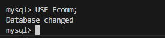
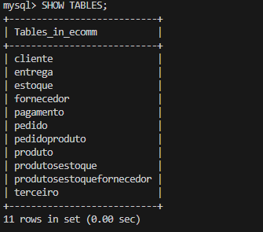
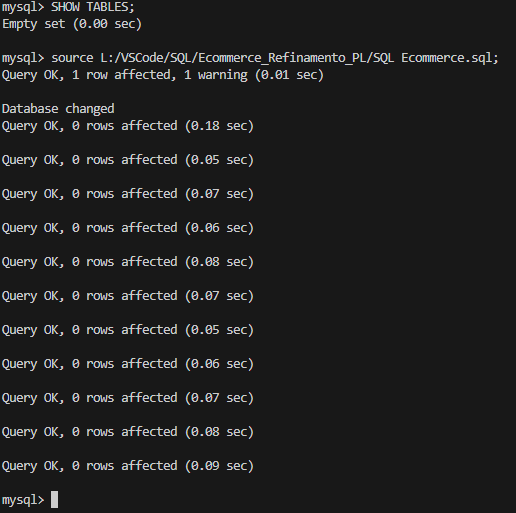
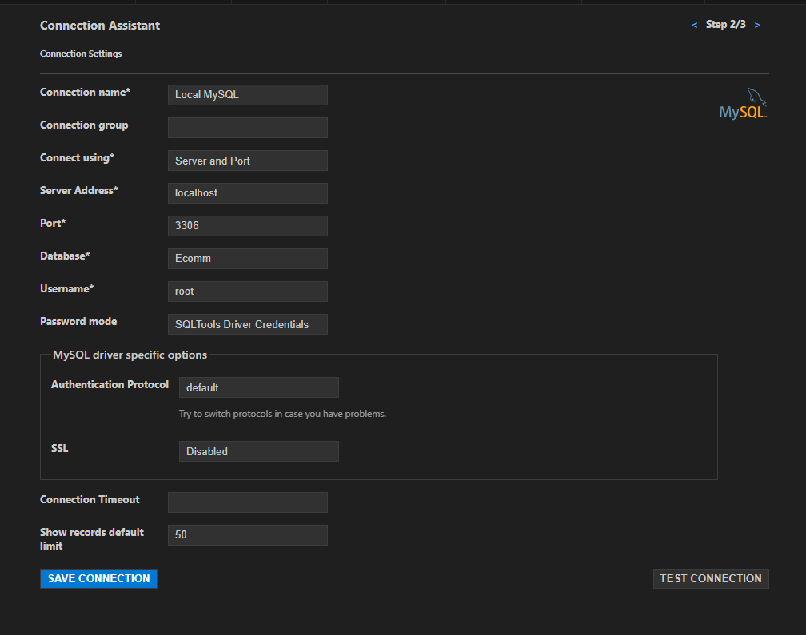
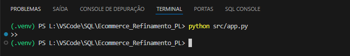
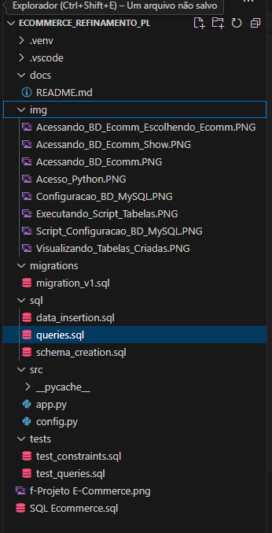

# Projeto E-commerce: Refinamento de Modelagem Lógica de Banco de Dados

## Descrição do Projeto

Este projeto consiste em replicar e refinar a modelagem lógica de um banco de dados para um cenário de e-commerce. O objetivo é aplicar as melhores práticas de modelagem e realizar consultas complexas para extrair informações relevantes do sistema. Além disso, o projeto considera as necessidades do cliente de distinguir entre pessoas físicas e jurídicas, incluir múltiplas formas de pagamento e gerenciar o status das entregas.

A modelagem considera a criação de tabelas com chaves primárias, estrangeiras e `constraints`, além de aplicar o mapeamento de entidades para gerar um modelo refinado, conforme as diretrizes do cenário.

## Estrutura do Projeto

### Tabelas Criadas

O projeto inclui a criação das seguintes tabelas no banco de dados MySQL:

- **Cliente**: Armazena informações sobre clientes, podendo ser Pessoa Física (CPF) ou Pessoa Jurídica (CNPJ), mas não ambos.
- **Produto**: Detalhes sobre os produtos disponíveis.
- **Pagamento**: Registra informações de pagamento dos clientes, permitindo múltiplas formas de pagamento.
- **Entrega**: Detalhes sobre as entregas dos pedidos, incluindo status e código de rastreio.
- **Pedido**: Informa os pedidos feitos pelos clientes e seus respectivos produtos.
- **Estoque**: Controla a quantidade de produtos disponíveis em estoque.
- **Fornecedor**: Fornecedores dos produtos.
- **Terceiro**: Vendedores e fornecedores terceiros.
  
### Relações

O sistema é desenhado com relacionamentos complexos entre as tabelas para garantir a integridade dos dados. As principais `constraints` e `foreign keys` são definidas para assegurar a consistência dos dados.

## Imagens do Processo

O projeto inclui imagens explicativas que mostram as etapas do processo de configuração e execução:

1. **Acessando o Banco de Dados Ecomm**:
   

2. **Visualizando as tabelas criadas**:
   

3. **Executando scripts no MySQL Workbench**:
   

4. **Configurando a conexão com o MySQL no Python**:
   

5. **Acessando o Python**:
   

6. **Estrutura do projeto**:
   

Essas imagens demonstram a execução correta dos passos do projeto e podem ser encontradas na pasta `img` do repositório.

## Ferramentas Usadas

- **MySQL Workbench**: Utilizado para criar e manipular o banco de dados e suas tabelas. Permite a visualização gráfica da estrutura do banco.
- **Visual Studio Code**: Editor de código onde foi desenvolvido todo o projeto, desde scripts SQL até o código Python para interação com o banco de dados.
- **Python 3.12.2**: Linguagem usada para interação com o banco de dados via scripts.
- **Pylance e SQLTools**: Extensões do VSCode para trabalhar com código Python e SQL.
  
## Bibliotecas e Pacotes

- **mysql-connector-python**: Biblioteca Python usada para conectar e manipular o banco de dados MySQL.
  - Comando de instalação:

    pip install mysql-connector-python

## Scripts Implementados

### 1. **`schema_creation.sql`**

Este arquivo contém os comandos SQL para criar as tabelas do banco de dados e definir suas relações. Ele pode ser executado diretamente no MySQL Workbench ou no terminal MySQL.

### 2. **`data_insertion.sql`**

Após a criação das tabelas, este script insere dados de exemplo nas tabelas do banco de dados para testes e validação.

### 3. **`queries.sql`**

Contém consultas SQL complexas que respondem perguntas como:

- Quantos pedidos foram feitos por cada cliente?
- Existe algum vendedor que também é fornecedor?
- Relação entre produtos, fornecedores e estoques.

As consultas implementam cláusulas como `JOIN`, `GROUP BY`, `HAVING`, `ORDER BY`, entre outras, para fornecer respostas detalhadas.

### 4. **`app.py`**

Este arquivo Python conecta-se ao banco de dados e executa funções que fazem consultas SQL, processam resultados e os exibem.

### 5. **`config.py`**

Contém as configurações de conexão com o banco de dados, como o `host`, `user`, `password` e o `database`. As credenciais são usadas no arquivo `app.py`.

### 6. **`migration_v1.sql`**

Script de migração para ajustar a estrutura do banco de dados durante o desenvolvimento.

### 7. **`test_constraints.sql`**

Este arquivo realiza testes para garantir que as `constraints` do banco de dados, como `primary keys`, `foreign keys` e `unique constraints`, estejam funcionando corretamente.

### 8. **`test_queries.sql`**

Este script contém consultas SQL usadas para testar e validar a consistência e a integridade dos dados inseridos no banco de dados.

## Como Executar o Projeto

### Pré-requisitos

1. **Instale o MySQL** em sua máquina.
2. **Clone o repositório** para sua máquina local:

   git clone <https://github.com/IOVASCON/Ecommerce_Primeiro_Projeto_Logico.git>

3. **Crie o ambiente virtual no Python:**
    python -m venv .venv
    .\.venv\Scripts\activate

4. **Instale as dependências:**
    pip install mysql-connector-python

5. **Execute o script para criar as tabelas:**
    No MySQL Workbench ou terminal:
    source L:/VSCode/SQL/Ecommerce_Refinamento_PL/sql/schema_creation.sql;

6. **Insira os dados de teste:**
    No MySQL Workbench ou terminal:
    source L:/VSCode/SQL/Ecommerce_Refinamento_PL/sql/data_insertion.sql;

7. **Execute o código Python:**
    python src/app.py

## Objetivo do Desafio

O desafio consiste em criar um banco de dados para um e-commerce, aplicando refinamentos na modelagem lógica. O projeto visa:

1. Diferenciar entre clientes PJ e PF.
2. Permitir múltiplas formas de pagamento para um cliente.
3. Gerenciar o status e o código de rastreamento das entregas.

## Perguntas respondidas pelo projeto

1. Quantos pedidos cada cliente fez?
2. Existe algum vendedor que também é fornecedor?
3. Qual a relação entre produtos, fornecedores e estoques?

## Contribuições

Sinta-se à vontade para clonar o repositório, enviar pull requests e sugerir melhorias.
Autor

Este projeto foi desenvolvido por [Izairton O de Vasconcelos].
